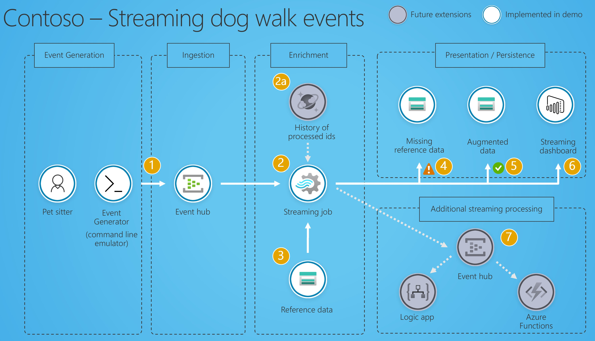

# Streaming in Azure Demos

Various streaming ingestion samples in Azure.

- **Dog walking event analytics**: Trusted client that emits events directly to Event Hubs. Data processed through Stream Analytics and data are displayed in a live PowerBI dashboard.

Deployment done through ARM templates and PowerShell scripts. [Demo code and more details](./DogWalkingDemo)

## References

- [Streaming as scale Azure samples](https://github.com/Azure-Samples/streaming-at-scale)
