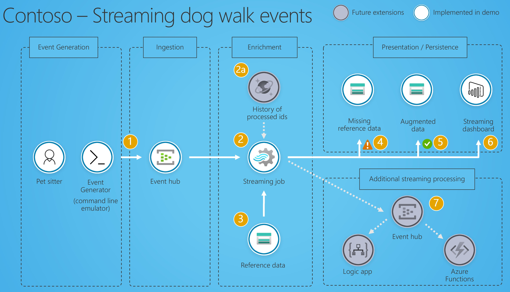
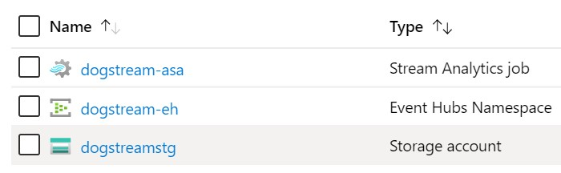
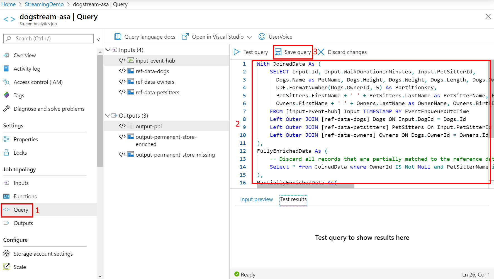
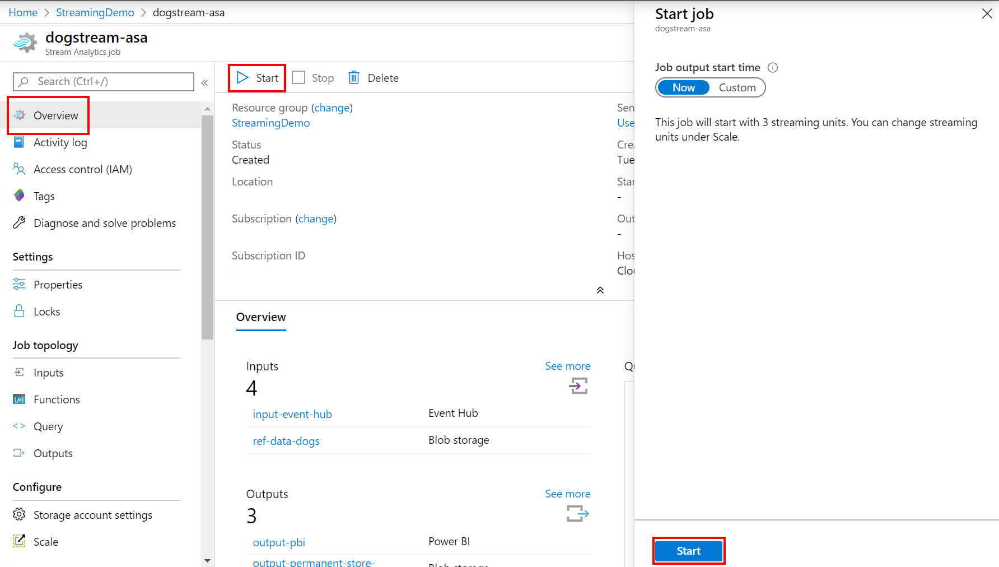
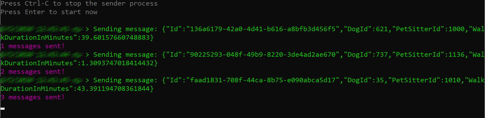
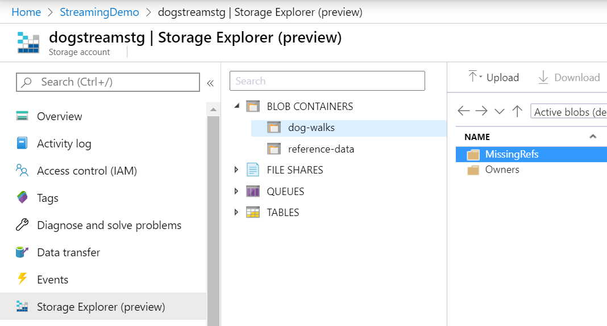
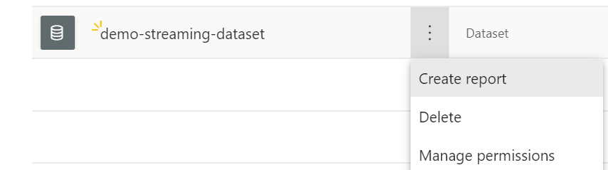
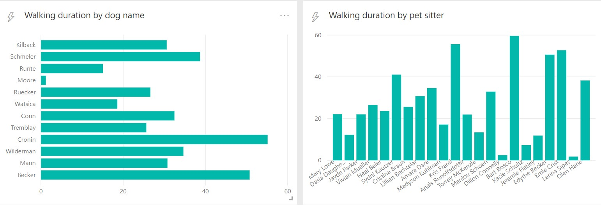

# Streaming in Azure Demo

## Use case

Contoso is a company keeping track of the pets and is running real time analytics on top of the walks data it collects.

Each owner (`Owner`) has multiple dogs (`Dog`). 
Each dog is being taken for a walk, 3 times a day, by a pet sitter (`PetSitter`). When the walk is done a message (`DogWalk`) is emitted which is processed by the real time streaming platform.

## Architecture

The [overall architecture](./Documents/architecture.pptx) is the following:



1. A console application named [EventGenerator](./EventGenerator/) is emitting events to [event hubs](https://docs.microsoft.com/en-us/azure/event-hubs/event-hubs-about). 
2. These events are processed by a [stream analytics job](https://docs.microsoft.com/en-us/azure/stream-analytics/stream-analytics-introduction).
  
   2a. Cosmos DB can be used to [ensure exact once message process](https://docs.microsoft.com/en-us/stream-analytics-query/event-delivery-guarantees-azure-stream-analytics#output-supporting-exact-once-delivery-with-azure-stream-analytics).

3. The `Dog`,`Owner` and `PetSitter` [reference data are read from a blob storage](https://docs.microsoft.com/en-us/azure/stream-analytics/stream-analytics-use-reference-data#generate-reference-data-on-a-schedule). Note that it's a best practice to store the reference data with the date pattern in their path in order to support potential updates.
4. The console application emits events with unknown `DogId` and `PetSitterId`. These records are routed to a [blob storage output](https://docs.microsoft.com/en-us/azure/stream-analytics/stream-analytics-custom-path-patterns-blob-storage-output). 
5. The successfully augmented data are stored in a different blob storage.
6. The data are streamed into a [Power BI streaming dataset which is feeding a streaming dashboard](https://docs.microsoft.com/en-us/azure/stream-analytics/stream-analytics-power-bi-dashboard).
7. Stream analytics can potentially [output in another Event Hubs](https://docs.microsoft.com/en-us/azure/stream-analytics/stream-analytics-define-outputs#event-hubs) which can then trigger additional processing either through a [coded approach in Azure Functions](https://docs.microsoft.com/en-us/azure/azure-functions/functions-bindings-event-hubs) or a [designer approach hosted in Logic Apps](https://docs.microsoft.com/en-us/azure/connectors/connectors-create-api-azure-event-hubs).

## Installation instructions

### Infrastructure as Code (IaC)

There are two approaches to deploy the necessary resources.


#### Option A) Deploy via portal and upload reference data manually

[](https://portal.azure.com/#create/Microsoft.Template/uri/https%3A%2F%2Fraw.githubusercontent.com%2Frndazurescript%2FStreamingInAzure%2Fmaster%2FDeployment%2Fpipeline_010_resources.json)  [](http://armviz.io/#/?load=https%3A%2F%2Fraw.githubusercontent.com%2Frndazurescript%2FStreamingInAzure%2Fmaster%2FDeployment%2Fpipeline_010_resources.json)

After deploying, upload the [reference data](./Deployment/storage_containers/reference-data/) in the corresponding storage container.

#### Option B) Deploy using powershell

Open a powershell, navigate to the [Deployment](./Deployment) folder and login in azure

``` powershell
Connect-AzAccount -Subscription $SubscriptionId  -Tenant $TenantId
```

After that you can deploy the resources and upload the [reference data](./Deployment/storage_containers/reference-data/) by running the following command and
providing the Resource Group name where you want to deploy the resources and the demo name which will act as a prefix for the resources you will deploy. 
> **NOTE:** DemoName should comply with [storage account names](https://docs.microsoft.com/en-us/azure/storage/common/storage-account-create?tabs=azure-portal), thus it can include numbers and lowercase letters only.

``` powershell
.\deploy.ps1
Supply values for the following parameters:
ResourceGroupName: 
DemoName: 
```

> **NOTE:** To execute not signed powershell scripts in your host you may have to disable signature checking
> ``` powershell
> Set-ExecutionPolicy -Scope Process -ExecutionPolicy Bypass
> ```

> **NOTE:** This scripts also generates the `secrets.json` file needed in the [EventGenerator project folder](./EventGenerator/).

### Configure Azure Stream Analytics job

Normally you would like to automate the deployment of Azure Stream Analytics job something that is feasible with the following steps:
- [Install Stream Analytics tools for Visual Studio](https://docs.microsoft.com/en-us/azure/stream-analytics/stream-analytics-tools-for-visual-studio-install)
- [Create a Visual Studio Stream Analytics Project](https://docs.microsoft.com/en-us/azure/stream-analytics/stream-analytics-quick-create-vs#create-a-stream-analytics-project).
- [Use MSBuild to build the project and generate ARM template](https://docs.microsoft.com/en-us/azure//stream-analytics/stream-analytics-tools-for-visual-studio-cicd)
- Deploy template using [AzResourceGroupDeployment](https://docs.microsoft.com/en-us/powershell/module/az.resources/new-azresourcegroupdeployment?view=azps-3.8.0).

For this demo, you will have to configure the job manually, something which will give you the opportunity to familiarize with Azure Stream Analytics.

#### Configure PowerBI output

In the portal, open the Stream Analytics job and navigate to `Outputs` (1). Select the `output-pbi` output (2) and click on the `Renew authorization` (3) to authorize the Azure Stream Analytics job to push data to the streaming dataset named `demo-streaming-dataset`.
After authorizing you will be able to configure the target group workspace (4) where you want to deploy the streaming dataset.
Click `Save` (5) to persist your changes.


#### Configure the streaming job

In the portal, open the Stream Analytics job and navigate to `Query` (1). Paste the following query in the query editor (2) and save the query (3).

``` SQL
With JoinedData As (
    SELECT Input.Id, Input.WalkDurationInMinutes, Input.PetSitterId,
      Dogs.Name as PetName, Dogs.Height, Dogs.Weight, Dogs.Length, Dogs.OwnerId,
      UDF.FormatNumber(Dogs.OwnerId, 5) As PartitionKey,
      PetSitters.FirstName + ' ' + PetSitters.LastName as PetSitterName, PetSitters.BirthDay as PetSitterBirthday, PetSitters.Rating, PetSitters.AverageWalkTimeInMinutes,
      Owners.FirstName + ' ' + Owners.LastName as OwnerName, Owners.BirthDay as OwnerBirthday
    FROM [input-event-hub] Input TIMESTAMP BY EventEnqueuedUtcTime
    Left Outer JOIN [ref-data-dogs] Dogs ON Input.DogId = Dogs.Id
    Left Outer JOIN [ref-data-petsitters] PetSitters On Input.PetSitterId = PetSitters.Id
    Left Outer JOIN [ref-data-owners] Owners ON Dogs.OwnerId = Owners.Id
), 
FullyEnrichedData As (
    -- Discard all records that are partially matched to the reference data
    Select * from JoinedData where OwnerId IS Not Null and PetSitterName is not Null and OwnerName is not Null
),
PartiallyEnrichedData As(
    Select * from JoinedData where OwnerId IS Null or PetSitterName is Null or OwnerName is not Null
)

-- Store in permanent store and output in powerBI
Select * Into [output-permanent-store-enriched] From FullyEnrichedData;
Select * Into [output-pbi] From FullyEnrichedData;

-- Store the incomplete data to the missing store in order to investigate later
Select * Into [output-permanent-store-missing] From PartiallyEnrichedData

```



For [common query patterns in Azure Stream Analytics, refer to this page](https://docs.microsoft.com/en-us/azure/stream-analytics/stream-analytics-stream-analytics-query-patterns).

## Running the demo

Having all infrastructure deployed and the stream analytics job configured, it's time to run the demo.

### Start the stream analytics job

In the portal, open the Stream Analytics job and click `Start`, ensure that `Now` is selected in the job output start time and click the `Start` button. 



### Run the emulator

Create a file named `secrets.json` in the [EventGenerator project folder](./EventGenerator/). The file should have the following format:

``` json
{
  "EventHubName": "name",
  "ConnectionString": "Endpoint=sb://name.servicebus.windows.net/;SharedAccessKeyName=RootManageSharedAccessKey;SharedAccessKey=blablabla"
}
```

where you can retrieve the [connection string following these instructions](https://docs.microsoft.com/en-us/azure/event-hubs/event-hubs-get-connection-string).

> **NOTE:** If you used deploy method b via powershell, the `secrets.json` is automatically generated for you.

Build an run the `EventGenerator` console application.



### Verifying results

In the storage account you should be able to see in the `dog-walks` container two folders:
- `MissingRefs` contains the records where either the owner or the dog or the pet sitter was not found in the reference data
- `Owners` contains the enhanced records partitioned by the ownerId.

All records are stored with date in their path `{yyyy}/{mm}/{dd}` in order to be able to retrieve faster the records by date.



In [PowerBI](https://www.powerbi.com/) you should be able to see a streaming dataset created.



You can create a dashboard following the [instructions of this article](https://docs.microsoft.com/en-us/azure/stream-analytics/stream-analytics-power-bi-dashboard#create-the-dashboard-in-power-bi).



## References

- Data generated using https://github.com/bchavez/Bogus.
- Diagram designed using [Book of Architecture](https://msarchitecture.azurewebsites.net/) resources.